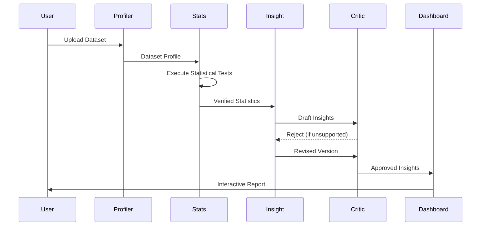

<div align="center">

# 🧠 EvidentAI

### Trustworthy AI Analytics through Multi-Agent Verification

**Generate statistically validated insights with autonomous AI agents that analyze, verify, and explain your data before delivering every result.**

<p align="center">


</p>

**Open Source • Multi-Agent AI • Explainable AI • Enterprise Analytics • Trust by Design**

---

*"Where AI proves its own work."*

[🚀 Features](#-features) •
[🏗 Architecture](#-architecture) •
[📊 Dashboard](#-dashboard) •
[⚡ Quick Start](#-quick-start) •
[🛣 Roadmap](#-roadmap)

</div>

---

# 🚀 Overview

EvidentAI is an **enterprise-grade multi-agent analytics platform** designed to solve one of the biggest challenges in modern AI systems:

> **How do you trust AI-generated insights?**

Most AI analytics tools rely on a single language model to analyze datasets and generate reports. While these systems are fast, they often lack mechanisms to verify whether their conclusions are actually supported by the underlying data.

EvidentAI introduces a **verification-first architecture**.

Instead of relying on one model, specialized AI agents collaborate throughout the analysis pipeline.

Real statistical computation is executed in a sandboxed environment, insights are generated independently, and every conclusion is reviewed by a separate Critic Agent before it reaches the user.

The result is an analytics platform focused on **accuracy, transparency, and explainability** rather than simply generating impressive-looking charts.

---

# ❌ The Problem

Traditional AI analytics platforms generally follow this workflow:

```
Dataset

↓

LLM

↓

Insights
```

If the model:

- misunderstands a correlation
- exaggerates a trend
- invents relationships
- misinterprets statistics

there is usually **nothing** verifying those conclusions.

Users receive polished reports—but not necessarily correct ones.

---

# ✅ The EvidentAI Approach

EvidentAI separates **reasoning** from **verification**.

```
Dataset

↓

Statistical Computing

↓

Insight Agent

↓

Independent Critic Agent

↓

Verified Insight
```

Every generated insight must successfully pass an independent verification stage.

If a claim isn't supported by computed statistics, it is rejected and regenerated before ever reaching the user.

---

# ✨ Features

## 🤖 Multi-Agent Intelligence

Specialized autonomous AI agents collaborate throughout the analytics workflow instead of relying on a single language model.

---

## 📊 Real Statistical Analysis

Performs actual statistical computation using executable Python code instead of relying on LLM reasoning.

Examples include:

- Correlation Analysis
- Outlier Detection
- Distribution Analysis
- Descriptive Statistics
- Feature Relationships
- Missing Value Analysis

---

## 🛡 Independent Verification

Every generated insight is reviewed by an autonomous Critic Agent running in an isolated reasoning session.

Unsupported conclusions are rejected automatically.

---

## 🔁 Automatic Retry Pipeline

Rejected insights are regenerated using critic feedback until they satisfy verification requirements.

Low-confidence outputs are never hidden—they are surfaced transparently with reviewer objections.

---

## 📈 Interactive Analytics Dashboard

Visualize datasets through:

- Ranked Insights
- Correlation Heatmaps
- Outlier Detection
- Statistical Summaries
- Live Processing Status
- Confidence Indicators

---

## 🔍 Full Agent Traceability

Every analysis includes a complete execution trail showing:

- Agent decisions
- Statistical outputs
- Critic reviews
- Retry history
- Final approval

---

## 🔒 Enterprise Security

Designed with production deployment in mind.

- Tenant Isolation
- Sandboxed Execution
- Malware Scanning
- JWT Authentication
- Encrypted Storage
- Row-Level Security

---

# 📸 Dashboard

> Replace the placeholders below with screenshots or GIF recordings.

## Dashboard


---

## Agent Workflow


---

## Correlation Heatmap


---

## Outlier Detection


---

## Agent Trail


---

## Live Processing


---

# 🎯 Why EvidentAI?

Unlike traditional AI analytics tools, EvidentAI doesn't assume that the first answer generated by an LLM is correct.

Instead, every result passes through multiple independent stages:

✔ Deterministic data profiling

✔ Real statistical computation

✔ AI-generated interpretation

✔ Independent verification

✔ Automatic correction

✔ Transparent confidence reporting

The goal isn't simply to generate insights.

The goal is to generate **trustworthy** insights.

---

# 💼 Use Cases

EvidentAI can be applied across multiple industries.

- 📊 Business Intelligence
- 💰 Financial Analytics
- 🏥 Healthcare Analytics
- 🛒 E-Commerce Insights
- 📈 Sales Performance
- 📦 Operations Monitoring
- 🔬 Research & Academia
- 📉 Risk Analysis
- 🏭 Manufacturing Analytics
- 🤖 AI Decision Support

---
# 🏗 System Architecture


---

# 🤖 Multi-Agent Architecture

Unlike conventional AI analytics platforms, EvidentAI assigns every stage of analysis to a dedicated autonomous agent.

Each agent has a clearly defined responsibility and communicates through structured outputs rather than shared prompts.

| Agent | Responsibility |
|--------|----------------|
| 📊 Data Profiling Agent | Profiles datasets, detects data types, null values, distributions, and schema information |
| 🧮 Statistical Analysis Agent | Executes deterministic statistical computations inside a sandboxed Python runtime |
| 🧠 Insight Agent | Converts statistical findings into ranked natural-language insights |
| 🔍 Critic Agent | Independently validates every generated insight against statistical evidence |
| 📑 Report Generator | Produces dashboards, summaries, and visual reports for end users |

This separation dramatically reduces hallucinations while making the reasoning process transparent and auditable.

---

# 🔄 End-to-End Workflow



---

# 🧮 Statistical Engine

Rather than asking an LLM to estimate statistical relationships, EvidentAI performs deterministic computation using executable Python code.

The analysis engine dynamically selects appropriate statistical techniques based on dataset characteristics.

Examples include:

### Correlation Analysis

- Pearson Correlation
- Spearman Correlation

---

### Distribution Analysis

- Mean
- Median
- Standard Deviation
- Quartiles
- Skewness

---

### Outlier Detection

- IQR Method
- Z-Score Detection

---

### Dataset Profiling

- Missing Values
- Duplicate Detection
- Cardinality Analysis
- Data Types
- Feature Distribution

---

### Relationship Discovery

- Numeric Feature Correlation
- Categorical Distribution
- Feature Importance Indicators

---

# 🛡 Verification Pipeline

The defining capability of EvidentAI is its independent verification process.

Every generated insight must successfully pass through an autonomous Critic Agent before being shown to the user.

```
Insight Generated

↓

Evidence Check

↓

Statistical Validation

↓

Approved

↓

User Dashboard
```

If verification fails:

```
Insight Generated

↓

Critic Rejects

↓

Feedback Generated

↓

Insight Regenerated

↓

Re-validated

↓

Approved
```

This retry mechanism significantly reduces unsupported conclusions while maintaining complete transparency.

---

# 🔍 Example Verification

### Initial Insight

> Customer age has a strong relationship with annual spending.

---

### Critic Review

```
Rejected

Observed Pearson Correlation:

0.34

Claim:

Strong Correlation

Reason:

Correlation coefficient does not support a strong relationship.

Recommendation:

Describe as a weak-to-moderate positive relationship.
```

---

### Revised Insight

> Customer age shows a weak positive relationship with annual spending.

✅ Approved

---

# 🚫 Hallucination Prevention

Traditional AI analytics systems rely almost entirely on language model reasoning.

EvidentAI combines deterministic computation with independent verification.

| Traditional AI | EvidentAI |
|----------------|-----------|
| Single LLM | Multi-Agent Pipeline |
| Prompt-Based Statistics | Executed Statistical Code |
| No Verification | Independent Critic Agent |
| Hidden Reasoning | Full Agent Trace |
| Confidence Without Evidence | Evidence-Backed Conclusions |

---

# 🔒 Security Model

Executing AI-generated code introduces real security risks.

EvidentAI treats code execution as an untrusted workload.

### 🔐 Sandboxed Execution

Every statistical computation executes inside an isolated environment using:

- Dedicated non-root user
- seccomp-bpf syscall filtering
- Resource limits
- Process isolation
- No outbound network access
- Restricted filesystem permissions

---

### 🏢 Tenant Isolation

Multi-tenant deployments enforce isolation using PostgreSQL Row-Level Security (RLS).

Every query is evaluated directly by the database engine, preventing accidental or malicious cross-tenant access.

---

### 🔑 Authentication

- JWT Access Tokens
- Rotating Refresh Tokens
- Argon2 Password Hashing

---

### 📂 Secure Upload Pipeline

Uploaded datasets pass through:

- File Type Validation
- Size Validation
- Malware Scanning
- Safe Parsing Pipeline

before any processing begins.

---

# 📈 Why Multi-Agent Instead of One LLM?

Most AI analytics products ask a single language model to perform every task:

- Read the dataset
- Analyze statistics
- Interpret findings
- Verify conclusions

This introduces a critical issue:

> The same model that generates an insight is responsible for validating it.

EvidentAI intentionally separates these responsibilities.

One agent focuses on interpretation.

A different agent focuses exclusively on verification.

This architectural separation improves reliability while making every decision traceable and explainable.

---
# 📊 Dashboard

EvidentAI provides an interactive analytics workspace that combines statistical computation, AI-generated explanations, and complete agent traceability.

---

## 📈 Insight Dashboard

The primary dashboard presents ranked insights generated from verified statistical evidence.

Features include:

- 📑 Ranked Insights
- 📊 Statistical Summary Cards
- 📈 Distribution Charts
- 🔥 Correlation Heatmaps
- 🚨 Outlier Detection
- 🎯 Confidence Scores
- 🔍 Drill-down Views

---

## 🤖 Agent Timeline

Every analysis exposes the internal execution flow.

Users can inspect:

- Data Profiling
- Statistical Execution
- Insight Generation
- Critic Verification
- Retry Attempts
- Final Approval

This creates complete transparency into how conclusions were produced.

---

## 📉 Interactive Visualizations

The dashboard automatically generates visual analytics including:

- Correlation Matrix
- Feature Distribution
- Missing Value Heatmaps
- Outlier Scatter Plots
- Category Distribution
- Trend Analysis
- Summary Metrics

---

## ⚡ Live Processing View

During execution, users can monitor each stage of the analysis pipeline in real time.

```
Uploading Dataset...

✔ Data Profile Complete

Running Statistical Analysis...

Generating Insights...

Critic Verification...

Preparing Dashboard...

Completed
```

---

# 🚀 Enterprise Features

### 📊 Explainable AI

Every insight includes supporting evidence and statistical references.

---

### 🔍 Transparent Decision Making

Every agent decision is logged and available for inspection.

---

### 📈 Confidence Scoring

Insights are categorized as:

- High Confidence
- Medium Confidence
- Low Confidence

Rejected insights remain visible with reviewer feedback instead of being silently discarded.

---

### 🔁 Automatic Recovery

Unsupported insights are regenerated automatically using structured critic feedback.

---

### 📦 Multi-Tenant Ready

Supports secure deployments for multiple organizations through tenant-aware storage and authentication.

---

### 🔒 Secure by Default

- Encrypted Storage
- Malware Scanning
- Sandboxed Execution
- Row-Level Security
- Secure Authentication

---

# 🛠 Technology Stack

## Frontend

| Technology | Purpose |
|------------|---------|
| React 18 | User Interface |
| TypeScript | Type Safety |
| Vite | Build Tool |
| Tailwind CSS | Styling |
| Recharts | Data Visualization |

---

## Backend

| Technology | Purpose |
|------------|---------|
| FastAPI | REST API |
| Python | Analytics Engine |
| Pydantic | Validation |

---

## AI Layer

| Technology | Purpose |
|------------|---------|
| Provider Agnostic LLM | Insight Generation |
| Multi-Agent System | Workflow Orchestration |
| Critic Agent | Independent Verification |

---

## Data Layer

| Technology | Purpose |
|------------|---------|
| PostgreSQL | Primary Database |
| Row-Level Security | Tenant Isolation |

---

## Security

| Technology | Purpose |
|------------|---------|
| JWT | Authentication |
| Argon2 | Password Hashing |
| seccomp | Sandbox Isolation |
| ClamAV | Malware Detection |

---

# 📁 Project Structure

```text
evidentai/

├── backend/
│   ├── api/
│   ├── agents/
│   │   ├── profiling/
│   │   ├── statistics/
│   │   ├── insights/
│   │   └── critic/
│   ├── services/
│   ├── security/
│   ├── models/
│   ├── database/
│   └── server.py
│
├── frontend/
│   ├── src/
│   │   ├── components/
│   │   ├── pages/
│   │   ├── charts/
│   │   ├── hooks/
│   │   ├── services/
│   │   └── utils/
│
├── uploads/
├── docs/
├── tests/
└── README.md
```

---

# ⚡ Quick Start

## Clone Repository

```bash
git clone https://github.com/yourusername/evidentai.git

cd evidentai
```

---

## Backend Setup

```bash
cd backend

python -m venv venv

source venv/bin/activate

pip install -r requirements.txt
```

---

## Frontend Setup

```bash
cd frontend

npm install
```

or

```bash
yarn
```

---

## Configure Environment Variables

Create a `.env` file inside the backend.

```env
POSTGRES_URL=

POSTGRES_AUTH_URL=

JWT_SECRET=

MASTER_KEK_B64=

OPENAI_API_KEY=

ANTHROPIC_API_KEY=

GOOGLE_API_KEY=
```

---

## Start Backend

```bash
uvicorn server:app --reload
```

---

## Start Frontend

```bash
npm run dev
```

---

## Open Application

Frontend

```
http://localhost:5173
```

Backend

```
http://localhost:8000
```

---

# 📡 API Overview

| Method | Endpoint | Description |
|---------|----------|-------------|
| POST | `/api/upload` | Upload dataset |
| GET | `/api/analysis/{id}` | Retrieve analysis |
| GET | `/api/agents/{id}` | Agent execution history |
| GET | `/api/dashboard/{id}` | Dashboard data |
| GET | `/api/health` | Health check |

---

# ⚙ Supported Dataset Formats

- CSV
- Excel (.xlsx)
- JSON
- TSV

---

# 📊 Performance

Designed for production workloads.

✔ Parallel Agent Execution

✔ Async Processing

✔ Large Dataset Support

✔ Streaming Updates

✔ Secure Execution

✔ Automatic Retry Pipeline

✔ Provider Agnostic

✔ Enterprise Ready

---
# 🗺 Roadmap

EvidentAI is designed as a long-term AI analytics platform. The current architecture has been built to support future autonomous analytics workflows.

## ✅ Completed

- Multi-Agent Analytics Pipeline
- Dataset Profiling
- Statistical Analysis Engine
- Independent Critic Agent
- Automatic Retry Pipeline
- Interactive Dashboard
- Correlation Analysis
- Outlier Detection
- Secure Sandboxed Execution
- Row-Level Security
- Multi-Tenant Architecture

---

## 🚧 In Progress

- Scheduled Dataset Monitoring
- Automated Statistical Test Recovery
- Exact LLM Token Accounting
- Agent Performance Metrics

---

## 🔮 Planned

- Live Database Connectors
- Snowflake Integration
- BigQuery Integration
- PostgreSQL Live Connections
- Slack Notifications
- Teams Integration
- Scheduled Reports
- AI Dashboard Builder
- Natural Language SQL
- Auto-generated Executive Reports
- Multi-Agent Collaboration
- Custom Agent Plugins

---

# 📊 Why EvidentAI?

Most AI analytics tools answer questions.

EvidentAI verifies them.

Instead of trusting a single language model to understand your dataset, EvidentAI combines deterministic statistical computation with autonomous AI agents that independently validate every generated insight.

This architecture prioritizes **correctness over confidence**, making AI-generated analytics more transparent, explainable, and reliable.

---

# ⚖ Comparison

| Capability | Traditional AI Analytics | EvidentAI |
|-------------|-------------------------|-----------|
| Statistical Computation | LLM Reasoning | Executed Python Code |
| Independent Verification | ❌ | ✅ |
| Multi-Agent Architecture | ❌ | ✅ |
| Automatic Retry | ❌ | ✅ |
| Explainable Decisions | Limited | Complete Agent Trail |
| Hallucination Detection | ❌ | ✅ |
| Confidence Reporting | Limited | Evidence-Based |
| Secure Code Sandbox | Rare | ✅ |
| Enterprise Multi-Tenant | Optional | Built-In |

---

# 💼 Enterprise Use Cases

EvidentAI can be deployed across multiple industries where trustworthy AI-assisted analytics are critical.

### 📊 Business Intelligence

Generate reliable executive reports backed by statistical evidence.

---

### 💰 Finance

Detect anomalies, spending patterns, customer segmentation, and revenue trends.

---

### 🏥 Healthcare

Analyze clinical datasets while maintaining explainability and auditability.

---

### 🏭 Manufacturing

Monitor production quality, equipment performance, and operational KPIs.

---

### 📦 Supply Chain

Identify bottlenecks, forecast inventory trends, and detect operational anomalies.

---

### 🛍 Retail & E-Commerce

Analyze customer behavior, product performance, and sales trends.

---

### 🎓 Research

Accelerate exploratory data analysis while maintaining scientific rigor.

---

# 🤝 Contributing

Contributions are welcome.

Whether you're fixing bugs, improving documentation, optimizing statistical workflows, or building new agents, we'd love your help.

## Getting Started

```bash
git clone https://github.com/yourusername/evidentai.git

git checkout -b feature/amazing-feature
```

After making your changes:

```bash
git commit -m "feat: add amazing feature"

git push origin feature/amazing-feature
```

Then open a Pull Request.

---

## Development Guidelines

Please ensure that:

- Code follows project conventions
- Tests pass successfully
- New features include documentation
- Pull requests include clear descriptions

---

# 🧪 Testing

Run backend tests

```bash
pytest
```

Run frontend tests

```bash
npm test
```

Lint project

```bash
npm run lint
```

---

# 📄 License

Distributed under the MIT License.

See the LICENSE file for more information.

---

# 🌟 Support

If you find EvidentAI useful:

⭐ Star the repository

🐛 Report issues

💡 Suggest new features

🤝 Contribute improvements

Every contribution helps make trustworthy AI analytics more accessible.

---

# 👨‍💻 Author

**Raghav Agarwal**

Full Stack Engineer • AI Engineer • Product Builder

**GitHub**

https://github.com/raghav26102000

**LinkedIn**

https://linkedin.com/in/raghav-agarwal26

---

# 🚀 Vision

We believe the future of AI analytics isn't about generating more answers.

It's about generating answers that can be trusted.

EvidentAI is built around one principle:

> **Every AI-generated insight should prove itself before anyone relies on it.**

By combining deterministic statistical computation with independent multi-agent verification, EvidentAI moves beyond AI-assisted analytics toward trustworthy AI decision support.

---

<div align="center">

# 🧠 EvidentAI

### Trustworthy AI Analytics through Multi-Agent Verification

**Where AI Proves Its Own Work.**

⭐ If you found this project interesting, consider giving it a star.

Built with ❤️ by **Raghav Agarwal**

</div>
